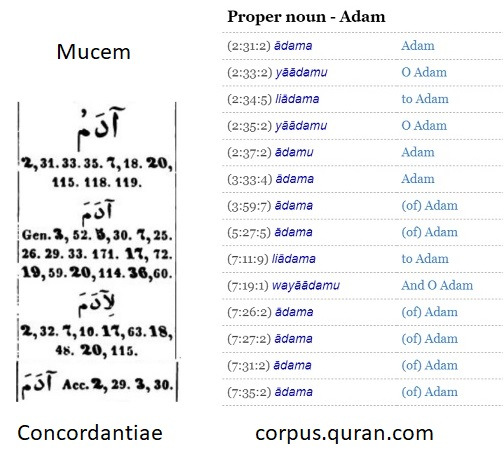

## Visual-Mujam

_Mujam_ is the general name for the books with a complete index of all the words in Quran. Latin name is Concordance.

For instance, the word _Adam_ occurs 25 times in Quran. _Concordantiae_ by G Flügel shows _Adam_ on [this page](https://archive.org/stream/concordantiaeco00flgoog#page/n28/mode/2up)

Then comes computer software. [Here is the list](http://corpus.quran.com/qurandictionary.jsp?q=adm) of all occurrences of the same word with links to follow.

Our aim in this project is to present the word list in a visual context. Several sample words were prepared manually. Two visual models currently under test:
* [Test2](https://maeyler.github.io/Visual-Mujam/test2.html)
* [Test3](https://maeyler.github.io/Visual-Mujam/test3.html)

The challenge is to make similar pages automatically for each of the 4700 distinct words in Quran...

June 4, 2018 -- Istanbul
